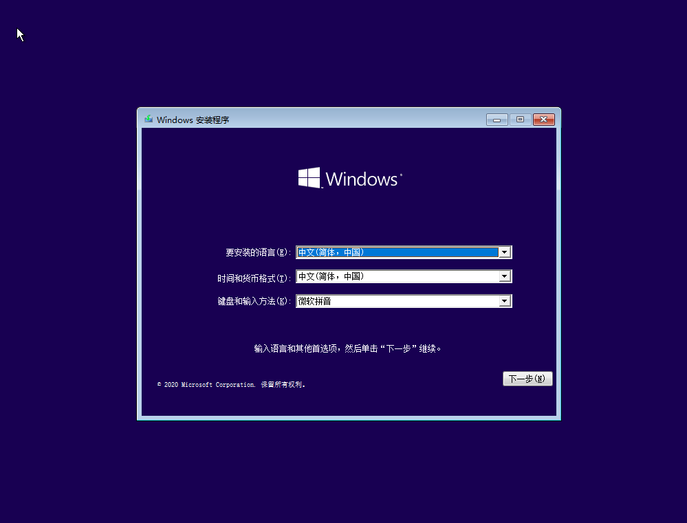
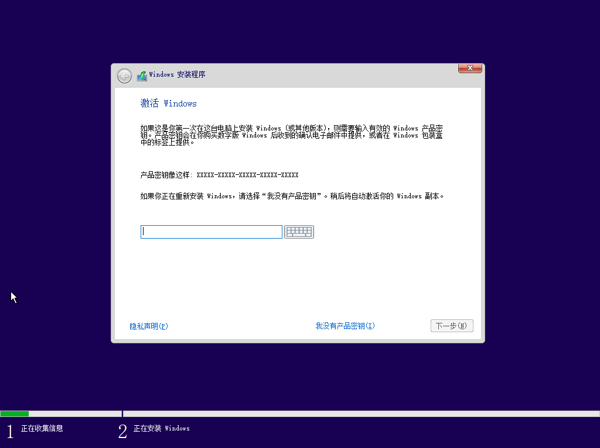
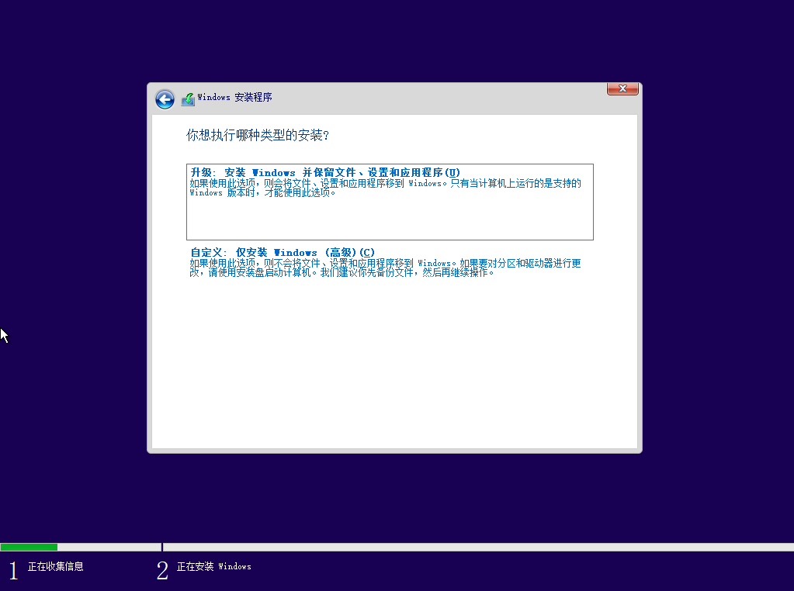
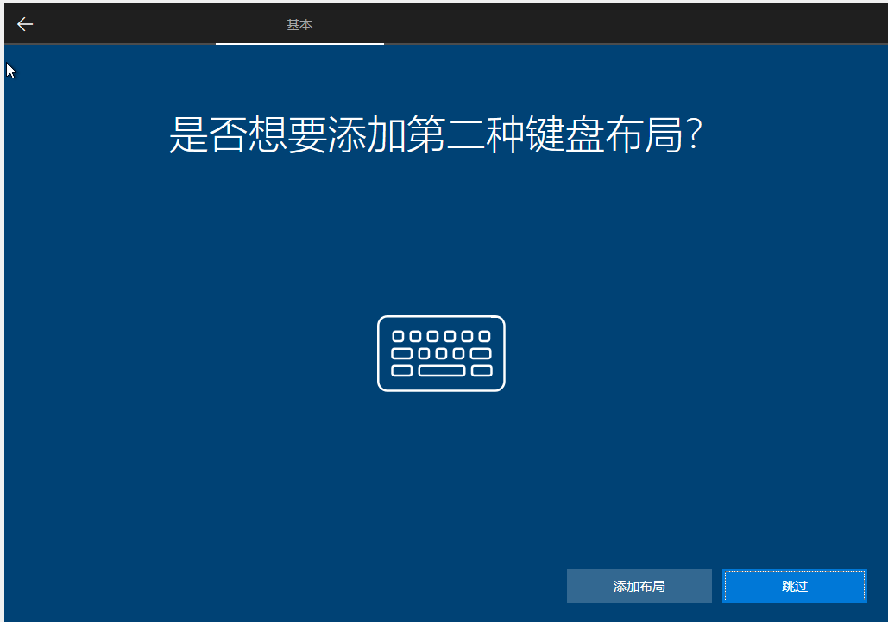

:::warning
- 安装时，计算机电量充足、不要中途强制关机。
:::

1. 

   直接点击“下一步”

2. 点击“现在安装”
3. 按提示输入产品密钥，或者以后激活：

   

4. 选择 Windows 安装方式：

   

   - 对于想升级系统版本的，可以选择“升级”
   - 对于全新电脑 u 盘安装，先点“自定义”，然后选择固态硬盘作为系统盘，直接点击下一步
   - 对于旧电脑，建议资讯专业人士建议来确定分区安装的方法，避免资料损失

5. 缓慢的安装等待

   

6. 设置

   1. 添加第二键盘布局：英语（美国）美——式键盘

      

      

      

      设置过程中出现问题可以按“跳过”按钮。

   2. 注册/登陆微软邮箱账号

      

   3. 创建PIN码：类似手机锁屏密码，注意不要太过简单、告诉别人哦！

      

   4. 隐私设置：全部都可以关闭，以获得更好的个人信息保护，
      但日后某些功能需要重新同意许可才能使用，稍微麻烦一点。

      

      完成其他时间线活动记录、手机号、Cortana等设置

7. 继续等待就绪
8. ok
